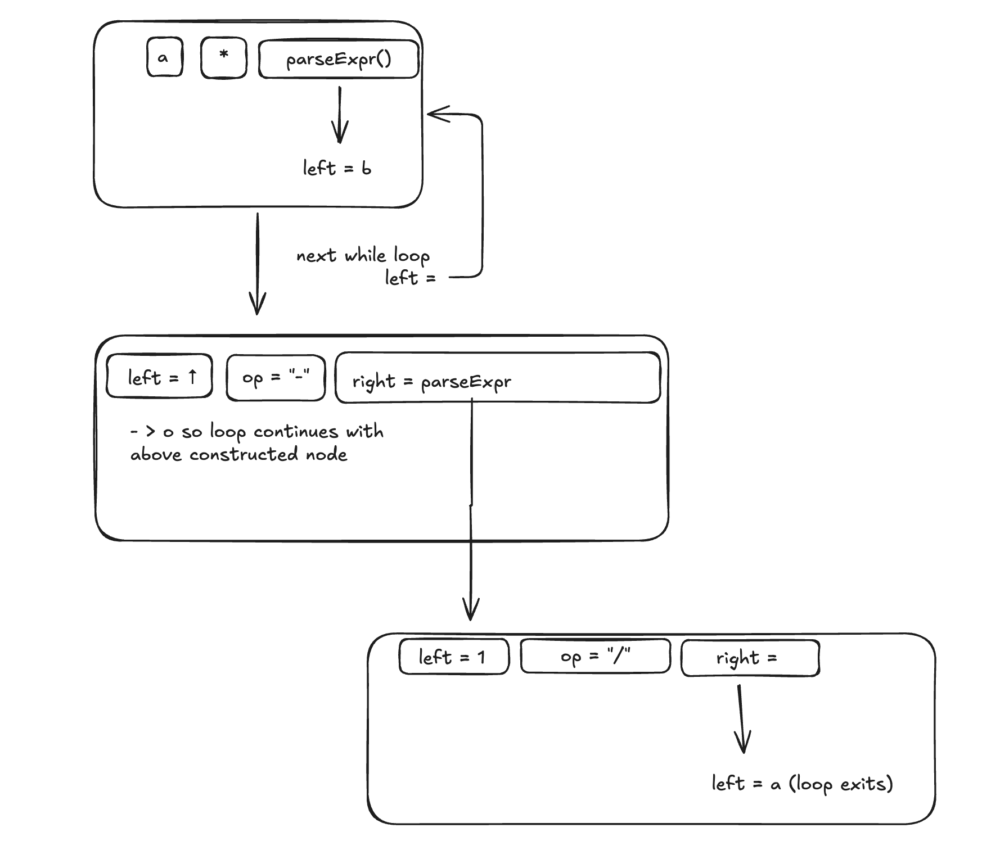

# To Future me:

```
book name: writing an interpreter in go
author: thorsten ball
```

- java std provides builtin func for checking whitespace, checking if char is digit and checking if char is alpahabet
- in golang have to be implemented yourself
- my implementation relies on static class being able to presist var values across calls whilst throsten would pass around a pointer to a instance of a struct


> "REPL" is basically like a node shell or jshell


### Pratt Parsing Visuals (referencing MyParser.java file)
